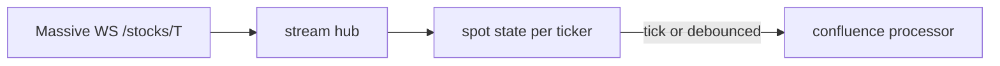
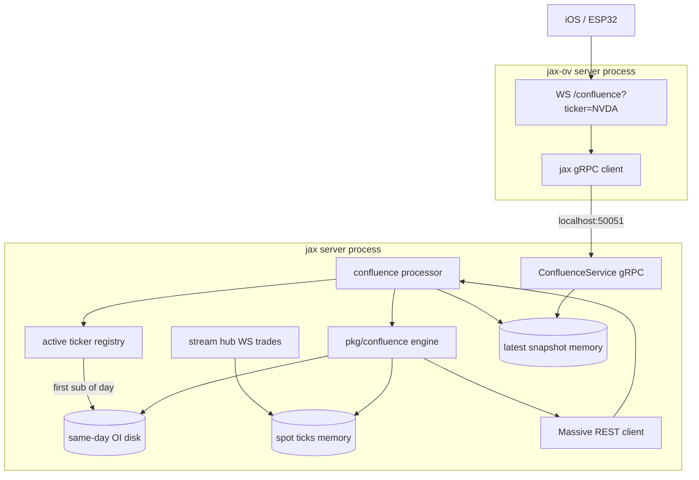
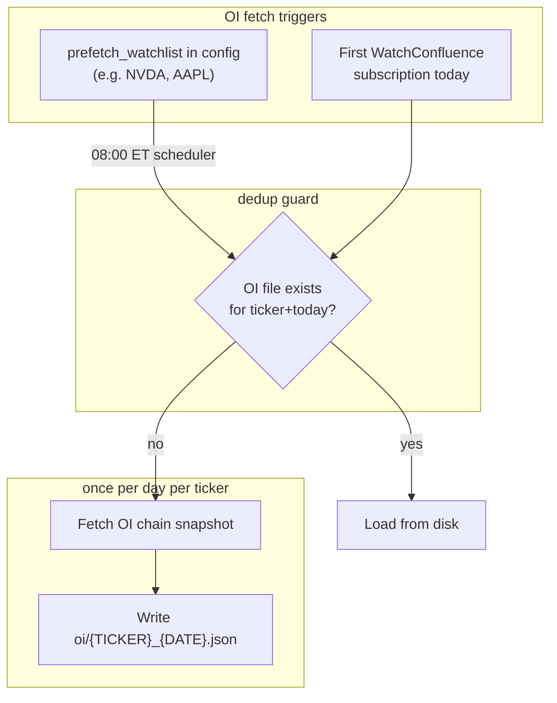
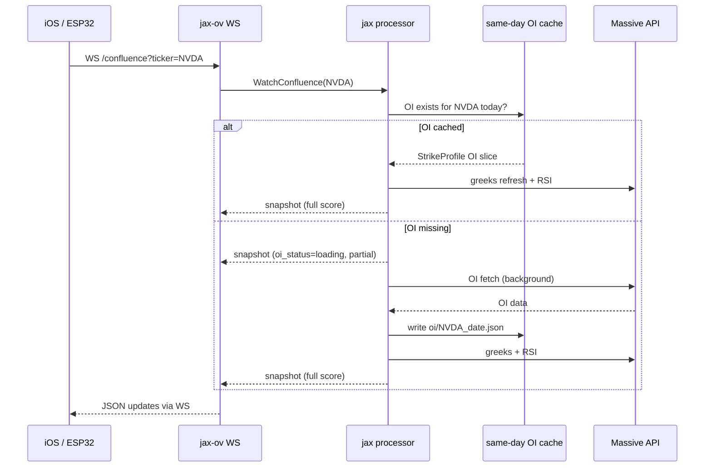
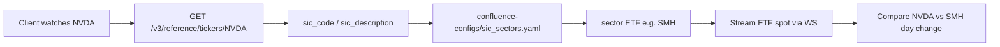

# Confluence Data API Plan

## Recommendation Summary

**Extend jax** for all signal computation and background processing. **Do not put confluence logic in jax-ov** beyond a thin gateway layer.

This is a **day-trading** use case: spot must be sub-second, RSI must be fresh on every score recompute, greeks refreshed at most every ~2 minutes (target 60–90s), OI fetched once daily.

---

## Massive Plan Entitlements (confirmed)

**Account:** Stocks Advanced + Options Advanced.

This unlocks everything the confluence service needs at **real-time recency** — no 15-minute delay fallback required.

| Capability | Plan | Used by confluence |
|------------|------|-------------------|
| Stock trades WebSocket (`T.*`) | Stocks Advanced | **Yes** — sub-second spot |
| Stock quotes WebSocket (`Q.*`) | Stocks Advanced | **Yes** — mid-price fallback |
| RSI indicator REST | Stocks Advanced | **Yes** — minute-timespan, real-time |
| Stock aggregates / last trade REST | Stocks Advanced | Fallback on WS reconnect |
| Options chain snapshot REST (greeks, OI) | Options Advanced | **Yes** — daily OI + intraday greeks |
| Options WebSocket (trades, `A`, `AM`) | Options Advanced | No — greeks not in WS payload |
| Options FMV WebSocket | Options Business only | No — not on our plan |

**Client config:** use `Feed: RealTime` on all WebSocket connections ([stocks trades docs](https://massive.com/docs/websocket/stocks/trades), [options chain snapshot docs](https://massive.com/docs/rest/options/snapshots/option-chain-snapshot)).

**Not a blocker:** Options FMV is Business-tier only and carries price estimates, not greeks — our REST chain snapshot approach is the right path on Options Advanced.

---

## Data Provider: Massive.com (formerly Polygon.io)

Massive.com is the current brand; jax uses `github.com/polygon-io/client-go` today. jax-ov already uses `github.com/massive-com/client-go/v2` for WebSocket. **Phase 0 should align jax on `massive-com/client-go/v2`** (REST + WebSocket) while keeping behavior identical.

**Key REST endpoints:**

| Need | Endpoint | Docs |
|------|----------|------|
| RSI (never cached) | `GET /v1/indicators/rsi/{stockTicker}` | [RSI](https://massive.com/docs/rest/stocks/technical-indicators/relative-strength-index) |
| Options greeks+OI | `GET /v3/snapshot/options/{underlyingAsset}` | [Chain snapshot](https://massive.com/docs/rest/options/snapshots/option-chain-snapshot) |
| Per-contract greeks | `GET /v3/snapshot/options/{underlying}/{contract}` | [Contract snapshot](https://massive.com/docs/rest/options/snapshots/option-contract-snapshot) |

**RSI for day trading:** `window=14`, `timespan=minute`, `series_type=close`, `limit=1`, `order=desc`. Real-time on Stocks Advanced. **No caching** — fetched on every score recompute.

**Greeks-only API:** Massive does **not** expose a greeks-only endpoint or field filter. Options:
1. **Preferred:** Filtered chain snapshot (`expiration_date` + strike range) → parse only `greeks` + discard quotes/trades/day/IV in memory immediately.
2. **Fallback:** Parallel per-contract snapshots for ~20–40 strikes if chain pagination is awkward (likely heavier on rate limits).

Typical filtered chain response: ~20–40 contracts × ~1–2 KB JSON on the wire → **~40–80 KB per greeks refresh**, but only ~1.6 KB retained in `OptionSlice`.

---

## Real-Time Streaming (Massive WebSocket)

Massive does **not** stream greeks on any plan (including Options Advanced). Options WebSocket feeds are trades, quotes, and aggregates — not greeks. **Greeks stay REST-polled** via real-time chain snapshots (Options Advanced). Spot and market context use stock WebSocket (Stocks Advanced).

### Available streams relevant to confluence

| Stream | Endpoint | Data | Our access |
|--------|----------|------|------------|
| **Stock trades** | [`WS /stocks/T`](https://massive.com/docs/websocket/stocks/trades) | Tick price, size, ms timestamp | **Real-time** (Stocks Advanced) |
| **Stock quotes** | [`WS /stocks/Q`](https://massive.com/docs/websocket/stocks/quotes) | NBBO bid/ask, ms timestamp | **Real-time**; mid when trades sparse |
| Options chain snapshot | [`GET /v3/snapshot/options/{underlying}`](https://massive.com/docs/rest/options/snapshots/option-chain-snapshot) | Greeks, OI, spot | **Real-time** (Options Advanced) |
| Options per-sec agg | `WS /options/A` | Volume/OHLC per contract | Available; jax-ov uses for volume — not needed here |
| Options FMV | `WS /options/FMV` | Fair value only | **Not on plan** (Business tier) |

### Stream hub: `internal/stream/`

New component in jax server — modeled on [`jax-ov/internal/websocket/client.go`](/Users/eric/Documents/workspace/jax-ov/internal/websocket/client.go) but for **Stocks** market:



- Single WebSocket connection; subscribe `T.{ticker}` for active watchlist + SPY/QQQ/sector peers.
- Maintain in-memory `SpotTick{Price, Timestamp}` per symbol (~32 bytes each).
- **Spot source priority:** live trade tick → quote mid → REST `GetLastTrade` fallback on reconnect.
- On each spot update: recompute levels that depend on spot (distance-to-entry, range position) immediately; debounce full score recompute to **≤5s** to batch RSI API calls.

---

## Architecture



---

## Data Storage & Lifecycle

**Principle:** no historical archive. We only keep **current working state** needed to serve live confluence. Nothing is stored for backtesting, audit, or replay after the session ends.

### What we do NOT store

- Time series of snapshots or scores
- Raw Massive API responses (chain snapshots, RSI payloads)
- Per-client history
- Cross-day data (purged at date rollover)

### Storage tiers

| Store | Location | Contents | Lifetime |
|-------|----------|----------|----------|
| **Spot ticks** | Memory | Latest price + timestamp per symbol | Until ticker deactivated |
| **Working slice** | Memory | Merged OI + greeks `OptionSlice` | Until ticker deactivated |
| **Latest snapshot** | Memory | Current `ConfluenceSnapshot` per ticker | Until ticker deactivated |
| **Daily OI slice** | Disk (same-day cache) | OI-only `StrikeProfile[]` keyed by `{ticker}_{date}` | Rest of trading day; deleted on date rollover |
| **Expiration map** | Memory | Soonest expiry + monthly flag per active ticker | Refreshed once daily per ticker |

Disk OI is **not historical storage** — it is a same-day cache so a server restart or second client connect does not re-trigger a slow OI fetch. Max size: ~5 KB × active tickers × 1 day ≈ negligible.

Config: `CONFLUENCE_CACHE_DIR` (default `./cache/confluence/`), gitignored.

### Which tickers get daily OI fetched?

**Never fetch OI for the full universe.** OI is expensive and only needed for tickers someone is actually watching.

Two sources define the OI fetch set:



| Source | When | Purpose |
|--------|------|---------|
| **`prefetch_watchlist`** | Scheduled 08:00 ET (config, optional) | Pre-warm OI for 2–3 tickers you always trade before market open |
| **First subscription** | When first client opens `WatchConfluence` for a ticker today | Lazy fetch — only tickers someone actually requests |

**Hard cap:** max **5 concurrent active tickers** (configurable). Reject or queue new subscriptions beyond cap.

**NOT fetched on:**
- Every client WebSocket reconnect (if OI file exists for today → load disk, skip API)
- Every greeks refresh
- Tickers with zero subscribers

Example `confluence-configs/settings.yaml`:

```yaml
# OI pre-fetched daily at 08:00 ET (before RTH)
prefetch_watchlist:
  - SPY
  - QQQ
  - SMH
  - IGV
  - IWM
  - HACK
  - MEME
  - XLE
  - XLI

# SPY (and optionally QQQ later): fetch OI for TWO expirations
dual_expiration_tickers:
  - SPY

max_active_tickers: 5
oi_prefetch_time: "08:00"   # ET

# Regular trading hours only
market_hours:
  timezone: America/New_York
  open: "09:30"
  close: "16:00"
```

**SPY dual expiration:** for tickers in `dual_expiration_tickers`, daily OI fetch pulls **two** soonest-relevant expirations:
1. **Soonest** expiration ≥ today (often 0DTE / daily)
2. **Soonest weekly** — nearest Friday expiration ≥ today that is **after** the soonest (or the nearest Friday if soonest is not Friday)

Levels and GEX/DEX are computed **per expiration**, then merged into the snapshot with each level tagged `expiration` + `expiry_weight`. Monthly OPEX on either slice gets full weight; weekly gets 0.65.

Individual stocks (e.g. NVDA) remain **lazy** — OI fetched on first subscription only.

**Roles of prefetched tickers:**

| Ticker | Role |
|--------|------|
| SPY, QQQ | Market strength axis; OI prefetched (SPY dual-exp) |
| SMH, IGV, IWM, HACK, MEME, XLE, XLI | Sector ETF benchmarks; OI prefetched if used as sector proxy; spot streamed when a watched stock maps to them |

Ad-hoc watched stocks still use lazy OI on first subscription.

### Active ticker lifecycle

A ticker becomes **active** when the first `WatchConfluence` gRPC stream opens (driven by jax-ov `/confluence` WebSocket).

| Event | Action |
|-------|--------|
| **First subscriber today** | Register active; load or fetch OI; subscribe stock WS; start greeks timer |
| **Additional subscriber same ticker** | Share existing state; no OI re-fetch |
| **Last subscriber disconnects** | After 5 min idle grace: stop greeks timer, unsubscribe WS, drop memory state; **keep OI on disk** for rest of day |
| **Same ticker resubscribes later same day** | Load OI from disk; warm greeks immediately; no OI API call |
| **Date rollover (midnight ET)** | Purge previous day's OI files; clear expiration map |

### Regular trading hours (RTH)

Processor and Massive subscriptions run **only during RTH: 9:30–16:00 ET** (configurable in `settings.yaml`).

| Outside RTH | Behavior |
|-------------|----------|
| No active subscribers | Stream hub disconnected; no greeks/RSI polling |
| Client connects pre-market | Accept WS; return last snapshot or `market_status: "closed"`; start processing at 09:30 |
| Client connected at close | Finish gracefully; stop greeks timer at 16:00; keep OI on disk for next day |
| Weekends / holidays | No OI prefetch (NYSE calendar); no processing |

Use `github.com/scmhub/calendar` (already in jax-ov) for trading-day checks on prefetch scheduler.



While OI is loading, snapshot includes `oi_status: "loading"` and suppresses GEX/DEX level signals (RSI, market, sector, spot-based range still work).

### What is fetched how often (summary)

| Data | Fetch trigger | Stored? |
|------|---------------|---------|
| OI | Once per ticker per day (prefetch OR first subscription) | Same-day disk only |
| Expiration | Once per ticker per day (with OI fetch) | Memory while active |
| Greeks | 60–90s while ticker active | Memory only (merged into working slice) |
| Spot | WS stream while ticker active | Memory tick only |
| RSI | Every score recompute | Not stored |
| Snapshot | Every recompute | Memory only (latest) |

---

## Options Data Strategy

### Soonest expiration + monthly strength weight

**Rule for single-expiration tickers:** use the **earliest expiration date ≥ today**.

**Dual-expiration tickers** (`SPY`, configurable): fetch and compute levels for **two** expirations (soonest + soonest weekly Friday) — see prefetch config above.

After resolving each expiration, classify it:
- **Monthly expiration** = standard 3rd-Friday-of-month (OPEX). Strength multiplier **1.0**.
- **Non-monthly** (weekly, end-of-week, etc.). Strength multiplier **0.65** (configurable in `confluence-configs/settings.yaml`).

The multiplier applies to:
- All GEX/DEX-derived level `strength` values
- Gamma/delta support axis scores
- Distance-to-entry sensitivity (tighter bands for monthly)

Re-resolve expiration once daily (or when today > cached expiry).

### Split refresh: OI daily (lazy), greeks frequent, spot streaming

| Data | Source | Frequency | Storage |
|------|--------|-----------|---------|
| **Open interest** | Filtered chain snapshot | **1× per ticker per day** (prefetch list OR first subscription) | Same-day disk cache |
| **Greeks** | Filtered chain snapshot | **60–90s** while ticker active; 5 min max | Memory only |
| **Spot** | WebSocket `T.{ticker}` | Sub-second while active | Memory tick only |
| **RSI** | REST indicator API | Every score recompute; never cached | None |
| **Market/sector** | Stream hub for SPY/QQQ/peers | Sub-second while any ticker active | Memory ticks |

**Greeks refresh triggers (whichever comes first):**
- Timer: 90s default (configurable down to 60s)
- Spot moved >0.5% since last greeks fetch (strike window may need re-centering)
- Never longer than 5 minutes

**Score recompute triggers:**
- Spot tick (debounced 5s max wait)
- Greeks refresh completed
- Manual/subscription start

Each recompute **always** calls RSI fresh.

---

## Reduced Memory Model

**Never store** full `OptionContractSnapshot` or raw API JSON in cache.

```go
type StrikeProfile struct {
    Strike    float32
    CallOI    uint32  // daily
    PutOI     uint32
    CallDelta float32 // intraday
    PutDelta  float32
    CallGamma float32
    PutGamma  float32
}

type OptionSlice struct {
    Ticker       string
    Expiration   string
    IsMonthly    bool
    ExpiryWeight float32
    Strikes      []StrikeProfile
    OIAsOf       time.Time
    GreeksAsOf   time.Time
}

// Dual-expiration tickers (e.g. SPY) hold []OptionSlice — one per expiration
```

Spot lives in `SpotState`, not in `OptionSlice`. Memory footprint scales only with **active** tickers (~3 KB each).

---

## Active Ticker Registry

New component: `internal/confluence/registry.go`

Tracks per ticker:
- Subscriber count (ref-count `WatchConfluence` streams)
- OI load state (`ready` / `loading` / `error`)
- Last greeks refresh time
- Idle-since timestamp for cleanup

Reference counting ensures multiple iOS clients on the same ticker share one OI fetch and one greeks loop.

---

## Multi-Level Support & Resistance

A single "largest cluster" is insufficient — price often respects several GEX/DEX peaks between spot and the dominant wall. Return a **ranked ladder of levels**.

### Step 1 — Per-strike exposure

Same as before: compute `netGEX[strike]` and `netDEX[strike]` from `OptionSlice` × live spot.

### Step 2 — Find all significant peaks (not just the max)

1. Run peak detection: local maxima where `value[i] > value[i±1]`.
2. Keep peaks above **20% of the largest peak** in that direction (support below spot, resistance above).
3. Merge peaks within **0.5% of spot price** into one level (same zone).

### Step 3 — Score each level

```
strength = (magnitude / maxMagnitude)
         × proximityFactor(distance from spot)
         × expiryWeight
         × sourceWeight  // GEX put wall vs DEX support, etc.
```

`proximityFactor`: peaks closer to spot score higher for entry relevance; far walls still listed but ranked lower.

### Step 4 — Output ladder

```json
"levels": {
  "gamma_flip": 122.0,
  "support": [
    { "price": 118.5, "source": "gex", "strength": 0.82, "rank": 1 },
    { "price": 116.0, "source": "gex", "strength": 0.54, "rank": 2 },
    { "price": 114.2, "source": "dex", "strength": 0.48, "rank": 3 }
  ],
  "resistance": [
    { "price": 125.0, "source": "gex", "strength": 0.71, "rank": 1 },
    { "price": 128.5, "source": "gex", "strength": 0.45, "rank": 2 }
  ],
  "nearest_support": 118.5,
  "nearest_resistance": 125.0
}
```

### Using levels in signals

| Signal | How levels are used |
|--------|---------------------|
| **Gamma support axis** | Weighted sum of support levels below spot within 3%; primary rank-1 GEX support drives axis fill |
| **Delta support axis** | Best DEX support level below spot |
| **Distance-to-entry** | Compare spot to rank-1 support band; secondary supports inform `early` if price between levels |
| **Confluence score** | Bonus when spot sits in a **stacked zone** (2+ supports within 1% band) — indicates confluence of dealers |

---

## jax: Core Engine

### `pkg/confluence/`

- `types.go`, `signals/*`, `score.go`, `config.go`
- `expiration.go` — soonest expiry, dual-exp for SPY, `IsMonthlyOPEX()` classifier
- `signals/levels.go` — multi-peak algorithm; merge dual-expiration levels
- `signals/sector.go` — SIC lookup → sector ETF → day performance vs target
- `signals/rsi.go` — REST call only, no cache layer

### `internal/stream/` (new)

- Massive WebSocket client (stocks trades + quotes)
- Subscription manager tied to active confluence watches
- Thread-safe spot state

### `internal/confluence/processor.go`

Event-driven loop:

1. Receive spot tick or greeks timer fire
2. Debounce (≤5s) → full recompute cycle
3. Load OI slice from disk; refresh greeks if due
4. Merge → `OptionSlice`; compute levels with live spot
5. **Fetch RSI (always fresh)**
6. Score + write snapshot; push `WatchConfluence` if changed

### gRPC: `api/proto/confluence/v1/confluence.proto`

Unchanged: `GetConfluence`, `WatchConfluence`.

---

## jax-ov Gateway

Unchanged: `WS /confluence?ticker=SYMBOL` → jax gRPC localhost.

---

## Scoring Logic (v1)

| Signal | Weight | Aligned heuristic |
|--------|--------|-------------------|
| Gamma support | 25% | Spot near rank-1 GEX support; stacked zone bonus; dual-exp levels merged |
| Delta support | 15% | Rank-1 DEX support below spot |
| RSI | 20% | Fresh RSI-14 ≤ 35 (minute timespan) |
| Market | 20% | SPY + QQQ live spot vs day open |
| Sector | 20% | Resolved sector ETF vs target ticker day performance |

### Sector strength via SIC → ETF mapping

Instead of a manual peer list per ticker, resolve sector dynamically:



**API:** [`GET /v3/reference/tickers/{ticker}`](https://massive.com/docs/rest/stocks/tickers/ticker-overview) returns `sic_code` and `sic_description` (e.g. `"3571"`, `"ELECTRONIC COMPUTERS"`).

**Config:** `confluence-configs/sic_sectors.yaml` maps SIC → sector ETF:

```yaml
# Match by sic_code (preferred) or sic_description substring
mappings:
  - sic_codes: ["3674", "3571", "3572"]   # semiconductors / computers
    sector_etf: SMH
  - sic_codes: ["7372", "7373"]           # software / services
    sector_etf: IGV
  - sic_description_contains: "PETROLEUM"
    sector_etf: XLE
  - sic_description_contains: "INDUSTRIAL"
    sector_etf: XLI
  # ... extend as we discover SICs in practice
default_sector_etf: IWM   # fallback when no mapping matches
```

**Caching:** ticker overview (SIC) cached in memory/disk **per ticker, refreshed weekly** — SIC rarely changes; not fetched on every recompute.

**Sector signal:** target ticker day % change vs resolved sector ETF day % change (both from stream hub spot vs day open). "Aligned" when sector ETF is flat/up and target is not underperforming ETF by >X%.

**Market signal:** same logic for SPY + QQQ (always prefetched/streamed during RTH when any ticker is active).

---

## Deployment on t3.nano

| Concern | Approach |
|---------|----------|
| RAM | Only active tickers in memory (~3 KB each + spot ticks) |
| Disk | Same-day OI only; auto-purge on date rollover; no growth over time |
| WebSocket | Subscribe/unsubscribe tied to active ticker registry |
| REST load | OI: 1×/day/active ticker; greeks ~40–60×/hour/active ticker; RSI on recompute |
| Data recency | **Confirmed real-time** on Stocks Advanced + Options Advanced — architecture as designed |

**Rate-limit mitigation:** increase recompute debounce to 10s before slowing greeks; never cache RSI. Advanced-tier rate limits are the main constraint on t3.nano, not data delay.

---

## Implementation Phases

### Phase 0 — Massive client + streaming
- Migrate jax to `massive-com/client-go/v2` (REST)
- RSI API (no cache wrapper)
- `OptionSlice` fetch with parse-time stripping
- Soonest-expiration resolver + monthly classifier
- `internal/stream/` WebSocket hub for stock trades

### Phase 1 — Signals + multi-level algorithm
- Multi-peak levels + expiry weighting + unit tests
- RSI, market, sector, range, entry signals
- `score.go` + `settings.yaml` + `sic_sectors.yaml`

### Phase 2 — Event-driven processor
- Wire stream hub → processor → snapshot cache
- Daily OI scheduler; greeks timer + spot-trigger refresh

### Phase 3 — gRPC surface

### Phase 4 — jax-ov WebSocket gateway

### Phase 5 — Hardening + rate-limit tuning

---

## Out of Scope

- ESP32 / round display UI
- iOS confluence radar UI
- Streaming greeks (not available from Massive)
- jax-ov volume data in confluence score

---

## Key Files

**jax:**
- `internal/stream/hub.go` (new)
- `internal/polygon/rsi.go`, `options_slice.go`, `expiration.go` (new)
- `pkg/confluence/` (new)
- `internal/confluence/registry.go`, `oi_cache.go`, `processor.go` (new)
- `api/proto/confluence/v1/confluence.proto` (new)
- `confluence-configs/settings.yaml` (prefetch_watchlist, dual_expiration_tickers, market_hours, max_active_tickers)
- `confluence-configs/sic_sectors.yaml` (SIC → sector ETF map)
- `cache-configs/cache_tasks.yaml` (optional OI prefetch task for prefetch_watchlist only)

**jax-ov:**
- `internal/confluence/client.go`, `ws.go` (new)
- `cmd/server/main.go` (`/confluence` route)
