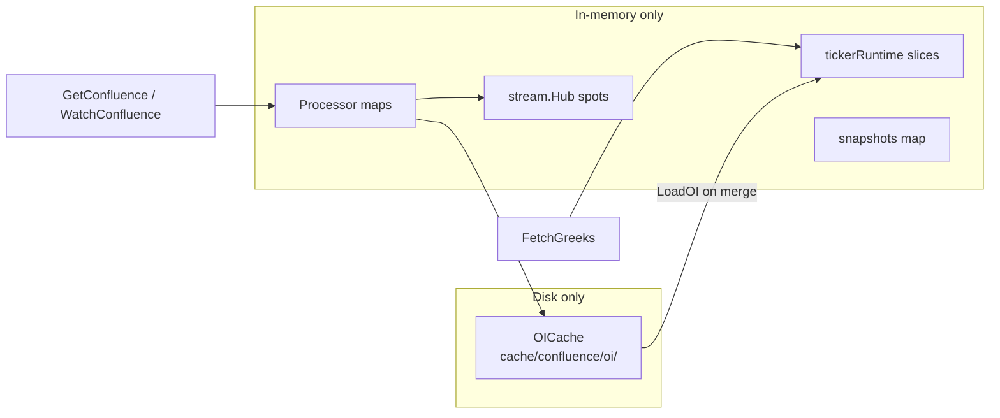

# Confluence Cache Inventory (Server Path)

Confluence does **not** use the legacy [`internal/cache`](internal/cache/cache.go) scheduler cache (`OptionChains`, `LastTrades`, `Aggregates`). It has its own storage in [`internal/confluence/`](internal/confluence/) plus the stream hub in [`internal/stream/hub.go`](internal/stream/hub.go).

---

## Disk cache (1 store)

| Store | Location | Key | Contents | Written when | Read when | Purged when |
|-------|----------|-----|----------|--------------|-----------|-------------|
| **OI slice** | `cache/confluence/oi/{TICKER}_{DATE}_{EXP}.json` (override via `CONFLUENCE_CACHE_DIR`) | ticker + market date + expiration | Reduced `OptionSlice` with **OI fields only** (~few KB/file) | First OI fetch per ticker/date/exp: subscription, bootstrap, or 08:00 prefetch | Every greeks refresh merges cached OI onto fresh greeks ([`fetch.go`](internal/confluence/fetch.go) `FetchOptionSlice` / `MergeSliceOI`) | [`PurgeBefore`](internal/confluence/oi_cache.go) at next-day prefetch (08:00 ET) |

**Prefetch watchlist** ([`settings.yaml`](confluence-configs/settings.yaml): SPY, QQQ, SMH, IGV, IWM, HACK, MEME, XLE, XLI) writes **disk only** — it does not load those slices into processor memory unless a client later watches a stock that needs them (e.g. SPY/QQQ for market axis).

**SPY dual expiration** = two OI files per day on disk.

---

## In-memory caches (Processor)

All live in [`Processor`](internal/confluence/processor.go) unless noted.

### Per watched ticker (`tickerRuntime` in [`loop.go`](internal/confluence/loop.go))

| Field | Contents | Lifetime |
|-------|----------|----------|
| `slices []OptionSlice` | Merged OI + greeks working data (1–2 expirations) | While ticker is active (subscribers > 0) |
| `expirations []time.Time` | Resolved expiration dates | Same |
| `sectorETF string` | Mapped sector ETF symbol (from SIC lookup) | Same |
| `greeksSpot float64` | Spot at last greeks refresh (for >0.5% move trigger) | Same |
| `watchers` + debounce/greeks timers | Push channels, timers | Same |

**Freed on deactivate** ([`deactivateTicker`](internal/confluence/loop.go)): after 5 min idle grace with zero subscribers — deletes `tickerRuntime`, unsubscribes WS, removes registry entry, **deletes snapshot**.

### Latest scored output

| Map | Key | Contents | Lifetime |
|-----|-----|----------|----------|
| `snapshots` | ticker | Full `ConfluenceSnapshot` (signals, levels, trade_plan, v2 fields) | Until `deactivateTicker` deletes it |

**Important server behavior:** unary `GetConfluence` / `GetConfluenceSummary` call `OnSubscribe` → bootstrap → `OnUnsubscribe` ([`confluence.go`](internal/service/confluence.go)), but the snapshot **stays in `snapshots`** until idle cleanup (~5 min). Repeated one-shot RPCs can accumulate snapshots for tickers not actively watched.

### Session-scoped (cleared at RTH open)

[`clearSessionCaches`](internal/confluence/market_data.go) runs on market open ([`onRTHOpen`](internal/confluence/loop.go)):

| Map | Key | Contents | TTL |
|-----|-----|----------|-----|
| `dailyBars` | `{ticker}_{date}` | Up to 30 daily OHLCV bars (ADR + breakout) | Until next 09:30 ET |
| `rsiDaily` | `{ticker}_{date}` | Daily RSI-14 value | Same |
| `shortVolRatio` | `{ticker}_{date}` | Short volume ratio | Same |
| `dayStats` | `{symbol}_{date}` | Intraday high/low/VWAP/volume for ticker + sector ETF | Same (only cached during RTH) |

### Multi-day in-memory (not cleared on ticker deactivate)

| Map | Key | Contents | TTL |
|-----|-----|----------|-----|
| `floatCache` | ticker | Float shares from ticker overview | **7 days** |
| `shortInterest` | ticker | Short interest %, days-to-cover, avg volume | **14 days** |

These persist for the life of the process even after a ticker is deactivated.

### Registry metadata (small)

[`Registry`](internal/confluence/registry.go): subscriber count, `OIState`, `LastGreeksAt`, `IdleSince` per ticker — not heavy, but entries linger during idle grace.

### Other processor state

| Field | Purpose | Cleanup |
|-------|---------|---------|
| `benchmarkRefs` | Ref-count for SPY/QQQ/sector ETF stream subscriptions | Released when last watched ticker drops that benchmark |
| `bootstrapLocks` | Per-ticker mutex map for bootstrap dedup | **Never pruned** — grows with distinct bootstrapped tickers |
| `rsiCallTimes` | Global RSI rate-limit window | Sliding window, bounded by `max_rsi_calls_per_minute` |

---

## In-memory: stream hub (spot only)

[`stream.Hub`](internal/stream/hub.go):

| Map | Key | Contents | Lifetime |
|-----|-----|----------|----------|
| `spots` | symbol | Latest `SpotTick{Price, Timestamp}` (~32 B) | While symbol has `subs` ref-count > 0 |
| `subs` | symbol | WebSocket subscription ref-count | Same |

Subscribed symbols for an active watch: **watched stock** + **SPY** + **QQQ** + **sector ETF** (e.g. SMH). Benchmark refs drop when no watched ticker needs them.

---

## Explicitly NOT cached

| Data | Behavior |
|------|----------|
| **RSI minute** | Fetched on every score recompute; no cache ([`market_data.go`](internal/confluence/market_data.go) uses `acquireRSISlot`, not a map) |
| **Raw Massive JSON** | Parsed into `StrikeProfile` / snapshot; not retained after merge |
| **Summary JSON** | Built on demand from snapshot in gRPC handler; not stored |
| **Snapshot history** | Only latest per ticker |
| **gRPC proto copies** | Allocated per response (`SnapshotToProto`); not cached |

---

## gRPC path summary

| RPC | Activates ticker? | Snapshot retained? | Disk touched? |
|-----|-------------------|-------------------|---------------|
| `GetConfluence` | Briefly (subscribe → unsub) | Yes, ~5 min+ idle | OI read/write if missing |
| `GetConfluenceSummary` | Same as above | Same | Same |
| `WatchConfluence` | Yes, until stream ends | Yes, until deactivate | OI + periodic greeks refresh |

---

## Rough size expectations (confluence only)

Designed footprint per **active** ticker is small (~3–15 KB for slices + ~2–5 KB snapshot). Dominant confluence memory growth risks are:

1. **Snapshots left behind** after unary `GetConfluence` calls (not immediate cleanup)
2. **`floatCache` / `shortInterest`** growing with distinct tickers queried over days/weeks
3. **`bootstrapLocks`** map never shrinking
4. **`dailyBars`** holding 30 bars × every ticker enriched that session
5. **Prefetch** is disk-only and cheap; **9 ETF OI files** ≈ tens of KB on disk, not RAM

This inventory excludes the legacy jax server caches (scheduler `GetOptionData` full chains, in-memory last-trades, disk aggregates) which are separate from confluence.

---

## If you later want confluence-only memory wins (out of scope for now)

Not implementing these yet per your request — listed for reference only:

- Drop snapshot immediately after unary `GetConfluence` when no watchers remain
- Move `floatCache` / `shortInterest` / `dailyBars` to disk with TTL (reuse `OICache` pattern)
- Prune `bootstrapLocks` after bootstrap completes
- Cap `dailyBars` / session maps to active tickers only
