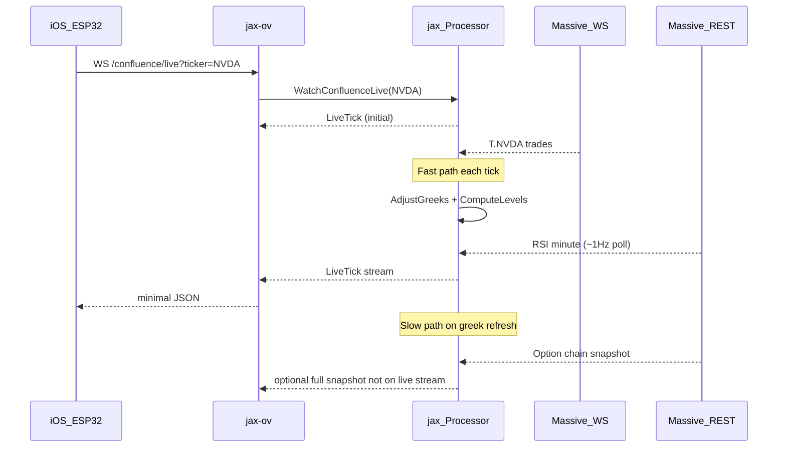

# Confluence Live Real-Time Endpoint

## Goal

Provide **sub-second feel** for active watches via a **new endpoint**, without changing [`WatchConfluence`](api/proto/confluence/v1/confluence.proto) or the existing jax-ov `/confluence` WebSocket.

**Locked decisions:**
- New RPC + new jax-ov route (not a second message type on the existing stream)
- Existing full snapshot watch remains for radar/detail clients
- Live tick payload: **spot, RSI, buy score, sell score (optional), one primary alert**

---

## Architecture



### Two update tiers (same ticker, shared processor state)

| Tier | Trigger | Massive calls | Output |
|------|---------|---------------|--------|
| **Live tick** | Every WS spot trade (or min 250ms coalesce) | RSI poll ~1Hz; **no** chain fetch | `ConfluenceLiveTick` |
| **Structural** | Greek refresh, readiness band change, OI reload | Chain snapshot REST | Updates processor baseline; existing `WatchConfluence` still emits full `ConfluenceSnapshot` |

Live ticks read from the same `tickerRuntime.slices` baseline but apply **local greek adjustment** between REST refreshes.

---

## 1. New API surface

### gRPC ([`api/proto/confluence/v1/confluence.proto`](api/proto/confluence/v1/confluence.proto))

Add:

```protobuf
rpc WatchConfluenceLive(WatchConfluenceRequest) returns (stream ConfluenceLiveTick);

message ConfluenceLiveTick {
  string ticker = 1;
  int64 timestamp = 2;        // server emit time
  int64 spot_timestamp = 3;
  double spot = 4;
  double rsi = 5;             // minute RSI-14
  double confluence_score = 6;
  double sell_score = 7;
  string readiness = 8;       // buy readiness band
  string alert = 9;           // single primary alert (see below)
  string alert_detail = 10;   // short human line
  int64 data_as_of = 11;
  string market_status = 12;
}
```

**Alert enum values** (string constants in Go, documented in proto comments):
- `none`, `buy_now`, `sell_now`, `trim`, `average_down`, `wait_entry`, `caution`

Derived in [`pkg/confluence/live_alert.go`](pkg/confluence/live_alert.go) from existing readiness, `exit_action`, and `trade_plan` — priority order: **sell_now > trim > average_down > buy_now > wait_entry > caution > none**.

### jax server ([`internal/service/confluence.go`](internal/service/confluence.go))

- `WatchConfluenceLive` handler: subscribe ticker (reuse `Processor.Watch` activation path), attach to new **live tick channel** (separate from full snapshot watchers in [`internal/confluence/loop.go`](internal/confluence/loop.go)).

### jax-ov ([`jax-ov/cmd/server/main.go`](jax-ov/cmd/server/main.go))

- New route: **`GET /confluence/live?ticker=SYMBOL`** (WebSocket only; HTTP GET returns 426 or a single tick snapshot for debugging).
- New convert type in [`jax-ov/internal/confluence/convert.go`](jax-ov/internal/confluence/convert.go): `LiveTick` JSON (~10 fields).
- Client method in [`jax-ov/internal/confluence/client.go`](jax-ov/internal/confluence/client.go): `WatchConfluenceLive`.

**Unchanged:** `/confluence`, `/confluence/summary`, `WatchConfluence`, `GetConfluence`.

---

## 2. Spot streaming (already exists — wire to live path)

[`internal/stream/hub.go`](internal/stream/hub.go) already delivers sub-second `T.{ticker}` trades.

Changes in [`internal/confluence/loop.go`](internal/confluence/loop.go):

- Add `onSpotTickLive` path parallel to debounced `runRecompute` (keep existing 5s path for `WatchConfluence` unchanged).
- **Coalesce** live ticks to max ~4/sec per ticker (250ms) to avoid flooding clients/CPU on t4g.nano.
- Live path uses hub spot directly; no REST last-trade per tick.

---

## 3. RSI — no Massive stream; 1Hz in-memory cache

Massive RSI is REST-only ([`internal/polygon/rsi.go`](internal/polygon/rsi.go)).

Add per-ticker **RSI poller** in [`internal/confluence/live_rsi.go`](internal/confluence/live_rsi.go):

- While ticker has **any** live or full watch subscriber: poll minute RSI every **1s** (configurable `live_rsi_interval_sec`).
- Store in `Processor.rsiMinute map[string]cachedRSI` with timestamp.
- Live tick reads cache; never blocks on REST.
- **Rate budget:** replace global `max_rsi_calls_per_minute` (12) for live mode with **per-active-ticker** budget (e.g. 60/min/ticker) in [`confluence-configs/settings.yaml`](confluence-configs/settings.yaml) under new `live:` section.
- On poll failure: emit last good RSI + `alert_detail` warning; do not stall stream.

**Future phase (document only):** local RSI from tick buffer or second aggregates WS if REST budget becomes tight at 5 concurrent watches.

---

## 4. Local greek adjustment ($1 spot band)

New package: [`pkg/confluence/signals/greek_adjust.go`](pkg/confluence/signals/greek_adjust.go)

```go
// AdjustSlicesForSpot returns a shallow-adjusted copy of slices when |newSpot - baseSpot| <= maxDollars.
// Per strike: delta' = delta + gamma * dSpot (calls and puts separately).
// Gamma held constant within band (user-approved simplification).
```

- Baseline: `tickerRuntime.slices` + `tickerRuntime.greeksSpot` at last REST refresh ([`refreshGreeks`](internal/confluence/loop.go)).
- Live tick: `adjusted := AdjustSlicesForSpot(rt.slices, rt.greeksSpot, tick.Price, cfg.Live.GreekAdjustMaxDollars)` default **$1.00**.
- Run `ComputeLevels(adjusted, spot)` + **fast score** (see below).
- If `|dSpot| > maxDollars` OR `|dSpot|/base > live_greeks_spot_pct` (tightened from 0.5% → e.g. **0.15%**, configurable): trigger async `refreshGreeks` (existing path).

Add unit tests: delta shifts correctly, levels move with spot, beyond-$1 returns `needsRefresh=true`.

---

## 5. Fast score path (live only)

Full [`BuildSnapshot`](pkg/confluence/signals/score.go) is too heavy for every tick (12 signals, trade_plan, enrichment).

Add [`pkg/confluence/signals/score_fast.go`](pkg/confluence/signals/score_fast.go):

- Inputs: spot, adjusted slices, cached RSI, cached session context (SPY/QQQ/sector spots from hub, day stats from session cache, ADR/SI from existing processor caches).
- Outputs: `confluence_score`, `sell_score`, `readiness` band, key gates only.
- Reuse existing signal calculators where cheap (RSI, gamma_support from adjusted levels, market/sector from cached opens).
- **Skip** on tick path: trade_plan rebuild, short squeeze re-fetch, ADR re-fetch.

When readiness band or sell `exit_action` changes vs last live tick, optionally notify full `WatchConfluence` watchers (existing fingerprint path) — live stream does not carry full snapshot.

---

## 6. Live push path in processor

Extend [`Processor`](internal/confluence/processor.go):

```go
liveWatchers map[string]map[int]chan *ConfluenceLiveTick  // per ticker
```

- `WatchLive(ctx, ticker)` mirrors `Watch()` but registers live channel.
- `emitLiveTick(ticker, tick)` on coalesced spot updates + on RSI cache refresh (if score moved).
- Live fingerprint includes **spot (1dp), RSI (1dp), score (1dp), alert** — not the old `snapshotFingerprint` (score + signal status only).
- No 30s [`pushDebouncePeriod`](internal/confluence/loop.go) on live path.

---

## 7. Config ([`confluence-configs/settings.yaml`](confluence-configs/settings.yaml))

New `live:` block:

```yaml
live:
  tick_coalesce_ms: 250
  rsi_interval_sec: 1
  rsi_max_calls_per_minute_per_ticker: 60
  greek_adjust_max_dollars: 1.0
  greek_refresh_spot_pct: 0.0015   # 0.15% (was 0.5%)
  greek_refresh_interval_sec: 60   # optional tighten from 90
```

Load in [`pkg/confluence/config.go`](pkg/confluence/config.go) with defaults safe for t4g.nano.

---

## 8. Additional work (beyond your four items)

| Item | Why |
|------|-----|
| **Proto + convert + Go client** | Contract for jax-ov and future Swift client |
| **Separate watcher ref-count** | Live + full watch share ticker activation/OI/greeks without double subscribe |
| **Coalescing + non-blocking send** | Protect nano instance from trade bursts |
| **Fast vs full score divergence** | Document that live score may differ slightly from `GetConfluence` until structural refresh; add test bounds |
| **RSI rate-limit handling** | Backoff + stale RSI flag in tick |
| **RTH gating** | Live stream outside RTH: emit last bootstrap spot/RSI with `market_status: closed` (no WS spam) |
| **Tests** | `greek_adjust_test`, `live_alert_test`, `score_fast_test`, processor live emit test |
| **Docs** | [`README.md`](README.md), [`docs/confluence-llm-analysis.md`](docs/confluence-llm-analysis.md), jax-ov README — endpoint matrix |
| **Cost note** | 5 watches × 1 RSI/s = 300 REST/min; document vs Stocks Advanced limits |

---

## 9. Implementation order

1. Proto `ConfluenceLiveTick` + `make proto`
2. `greek_adjust.go` + tests
3. `live_alert.go` + `score_fast.go` + tests
4. Processor: RSI poller, live watchers, spot coalescer, `WatchLive`
5. gRPC `WatchConfluenceLive` in [`internal/service/confluence.go`](internal/service/confluence.go)
6. jax-ov `/confluence/live` + convert + client
7. Config + docs
8. Manual verify: `grpcurl` stream + WS on t4g.nano

---

## 10. Client usage (target)

```bash
# jax-ov (iOS / ESP32)
ws://host/confluence/live?ticker=NVDA

# jax gRPC
grpcurl -plaintext -d '{"ticker":"NVDA"}' localhost:50051 jax.v1.ConfluenceService/WatchConfluenceLive
```

Example tick JSON:

```json
{
  "ticker": "NVDA",
  "spot": 142.35,
  "rsi": 28.4,
  "confluence_score": 58,
  "sell_score": 22,
  "readiness": "possible_entry",
  "alert": "buy_now",
  "alert_detail": "At GEX support — watch for entry",
  "market_status": "open"
}
```

Full radar/detail: continue using `/confluence` WebSocket or `GetConfluence`.
