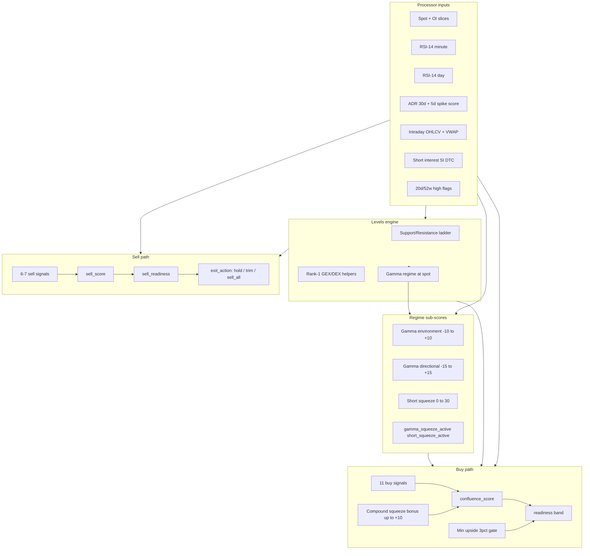

# Confluence Scoring v2

## Goals

Enhance the existing **buy** composite (`confluence_score` / `readiness`) and add a parallel **sell** path for long exits only. Incorporate trade geometry (upside to resistance, downside to support), ADR% for day-trade suitability, daily RSI at lower weight, and higher sector vs market weighting.

**Confirmed constraints from you:**
- Upside tiers: **&lt;3% = not worth buying**, **3–6% = acceptable**, **6%+ = great** but often thin/low-ADR names
- Prefer **sustained high ADR% over 30 days**; penalize low 30d + high 5d spike (revert risk)
- **Sell score for long exits only** — no shorting
- Exit guidance: **trim** vs **sell_all** when first resistance is hit but a larger wall still offers room above
- **Gamma is a volatility amplifier, not a simple bullish/bearish flag** — expose regime + squeeze state as fields and score direction separately
- Positive gamma suppresses directional moves (mean-reversion friendly); negative gamma amplifies trends (squeeze fuel, needs direction)

---

## Current state (baseline)

| Signal | Weight | File |
|--------|--------|------|
| gamma_support | 25% | [`pkg/confluence/signals/gex.go`](pkg/confluence/signals/gex.go) |
| delta_support | 15% | [`pkg/confluence/signals/dex.go`](pkg/confluence/signals/dex.go) |
| rsi (minute only) | 20% | [`pkg/confluence/signals/rsi.go`](pkg/confluence/signals/rsi.go) |
| market (SPY/QQQ) | 20% | [`pkg/confluence/signals/market.go`](pkg/confluence/signals/market.go) |
| sector ETF | 20% | [`pkg/confluence/signals/sector.go`](pkg/confluence/signals/sector.go) |

Sector and market are **equal today** — sector should be higher.

Levels already expose ranked ladders ([`pkg/confluence/signals/levels.go`](pkg/confluence/signals/levels.go)): `Support[]` / `Resistance[]` sorted by strength (rank 1 = strongest). `NearestSupport` / `NearestResistance` are price-nearest, not strength-ranked. Entry timing uses nearest support ([`pkg/confluence/signals/entry.go`](pkg/confluence/signals/entry.go)).

No ADR, no daily RSI, no sell score, no gamma regime/squeeze fields in proto ([`api/proto/confluence/v1/confluence.proto`](api/proto/confluence/v1/confluence.proto)).

`gamma_flip` exists in levels but **gamma regime (positive/negative/neutral) is not exposed** — only computed internally in [`findGammaFlip`](pkg/confluence/signals/levels.go). No short-interest or RVOL data fetched today.

---

## Architecture



---

## 1. Trade geometry (upside + downside)

### New helpers in [`pkg/confluence/signals/levels.go`](pkg/confluence/signals/levels.go)

- `Rank1Resistance(levels)` — first entry in `Resistance[]` (strongest wall above spot)
- `SecondSupport(levels)` — `Support[1]` if present (floor below rank-1 support)
- `TradeGeometry(spot, levels) → {UpsidePct, DownsidePct, RiskReward, UpsideTarget, StopSupport}`

### Upside target (1a)

Use **rank-1 resistance** as the primary upside ceiling (“first big resistance”), not `NearestResistance` (which may be a weak nearby strike).

```
upside_pct = (rank1_resistance.price - spot) / spot
```

Fallback chain if no rank-1 resistance: `NearestResistance` → no upside data (signal suppressed).

### Downside floor (1b)

Use **second support** in the ladder as the stop reference below the entry zone:

```
downside_pct = (spot - second_support.price) / spot
```

Fallbacks when only one support exists:
1. `gamma_flip` if below spot and within 5% of spot
2. Synthetic 2% floor (`spot * 0.98`) — flagged in signal detail as estimate

```
risk_reward = upside_pct / max(downside_pct, 0.001)
```

### New buy signals

| Signal | Weight | Scoring logic |
|--------|--------|---------------|
| `upside` | 8% | Tiered axis fill (see below) |
| `downside` | 4% | Favors R/R ≥ 2; penalizes wide stop (&gt;4% below spot) |

**Upside tiered fill** (your thresholds):

| upside_pct | axis_fill | buy implication |
|------------|-----------|-----------------|
| &lt; 1% | 0.0 | trivial — hard gate |
| 1–3% | 0.0–0.3 linear | below ideal minimum |
| 3–6% | 0.5–0.85 linear | acceptable day-trade room |
| ≥ 6% | 0.85–1.0 | great room, then ADR modifier applies |

**Hard gate:** if `upside_pct < 3%` (configurable `min_upside_pct: 0.03`), cap `readiness` at `caution` and never `possible_entry` / `high_conviction` regardless of other signals. Detail: `"upside 1.2% below 3% minimum"`.

---

## 2. ADR% (dual-window complex score)

ADR is **not** in the codebase today. A single ADR number is insufficient — **sustained** volatility (30d) and **recent** volatility (5d) must be compared. A stock with low 30d ADR but a sudden 5d spike is often a news-driven pop that may revert; a stock with consistently high 30d ADR is a better day-trade candidate.

Daily aggregates via [`internal/polygon/client.go`](internal/polygon/client.go) `GetAggregates` and [`internal/confluence/fetch.go`](internal/confluence/fetch.go).

### Per-session ADR

For each daily bar:

```
session_adr_pct = (high - low) / close * 100
```

### Dual windows

Add [`pkg/confluence/adr.go`](pkg/confluence/adr.go):

```
adr_30d_pct = mean(session_adr_pct) over last 30 sessions
adr_5d_pct  = mean(session_adr_pct) over last 5 sessions
adr_spike_ratio = adr_5d_pct / max(adr_30d_pct, 0.01)
```

Requires **30 daily bars** per fetch (shared with 20d/52w high logic).

### ADR regime classification

| Regime | Condition | Meaning |
|--------|-----------|---------|
| `stable_high` | adr_30d ≥ 4% AND spike_ratio &lt; 1.3 | Established volatile name — ideal for day trading |
| `workable` | adr_30d 2–4% AND spike_ratio &lt; 1.4 | Acceptable range |
| `stable_low` | adr_30d &lt; 2% AND spike_ratio &lt; 1.3 | Too tight — poor day-trade candidate |
| `spike_warning` | adr_30d &lt; 3% AND adr_5d ≥ 4% AND spike_ratio ≥ 1.4 | Recent jump on normally quiet name — revert risk |
| `spike_fade` | adr_30d ≥ 3% AND spike_ratio ≥ 1.6 | Even volatile names can be extended after a burst |
| `contracting` | spike_ratio &lt; 0.8 | Volatility compressing — less opportunity |

Expose: `adr_30d_pct`, `adr_5d_pct`, `adr_spike_ratio`, `adr_regime`.

Keep `adr_pct` as alias for `adr_30d_pct` (backward compat in proto).

### Complex buy signal `adr` (5% weight)

Two-component score, then combine:

**Component A — 30d base (sustained suitability), 70% of ADR signal:**

| adr_30d_pct | base_fill |
|-------------|-----------|
| &lt; 2% | 0.15 |
| 2–3% | 0.45 |
| 3–5% | 0.70 |
| ≥ 5% | 0.90 |

**Component B — spike modifier, 30% of ADR signal:**

| Regime | modifier_fill |
|--------|---------------|
| `stable_high` | 1.0 |
| `workable` | 0.85 |
| `stable_low` | 0.5 |
| `spike_warning` | **0.25** — heavy penalty; recent pop on quiet base |
| `spike_fade` | 0.55 — caution even on normally volatile names |
| `contracting` | 0.60 |

```
adr_axis_fill = 0.70 * base_fill(adr_30d) + 0.30 * modifier_fill(regime)
```

**Readiness interaction:** if `adr_regime == spike_warning`, cap buy `readiness` at `caution` (same severity as sub-3% upside gate) — do not promote to `possible_entry` on a likely revert name.

### ADR × upside interaction

When `upside_pct ≥ 6%`, multiply upside axis_fill by **ADR confidence** derived from 30d (not 5d alone):

| adr_30d_pct | upside multiplier |
|-------------|-------------------|
| &lt; 2% | ×0.4 |
| 2–4% | ×0.75 |
| ≥ 4% | ×1.0 |

If `adr_regime == spike_warning`, apply an extra ×0.6 on upside (room-to-run may be a one-day anomaly).

### Fetch + cache (cost-aware)

- Fetch **30 daily bars** once per ticker per trading day at activation/bootstrap
- Store in `adrCache` alongside 20d/52w highs — single aggregates call
- Do **not** refresh on every spot tick

Expose on snapshot: `adr_30d_pct`, `adr_5d_pct`, `adr_spike_ratio`, `adr_regime`, plus geometry fields `upside_pct`, `downside_pct`, `risk_reward`.

**Example contrast:**

| Ticker | adr_30d | adr_5d | spike_ratio | regime | ADR signal |
|--------|---------|--------|-------------|--------|------------|
| NVDA (typical) | 4.2% | 4.5% | 1.07 | `stable_high` | Strong — consistently tradable |
| Quiet name + news pop | 1.8% | 5.1% | 2.83 | `spike_warning` | Weak + readiness capped — likely revert |

---

## 3. RSI daily (lower weight than minute)

### API

Extend [`internal/polygon/rsi.go`](internal/polygon/rsi.go):

```go
GetRSI(ctx, ticker, window, timespan) // timespan: minute | day
```

### Processor

- Minute RSI: existing debounced path (~every recompute)
- Daily RSI: fetch at ticker activation + once per session day; pass as `RSIDaily` in [`pkg/confluence/types.go`](pkg/confluence/types.go) `ScoreInput`

### Signals

Split current single `rsi` into:

| Signal | Weight | Logic |
|--------|--------|-------|
| `rsi_minute` | 14% | Existing oversold ≤35 logic ([`rsi.go`](pkg/confluence/signals/rsi.go)) |
| `rsi_daily` | 4% | Same thresholds, softer curve (daily oversold is supportive but not timing-critical) |

Proto: keep `rsi` as minute for backward compat; add `rsi_daily`.

---

## 4. Rebalanced buy weights (sector &gt; market)

Move weights from hardcoded constants into [`confluence-configs/settings.yaml`](confluence-configs/settings.yaml) under new `signal_weights` block. Defaults:

Load via new `ScoringConfig` in [`pkg/confluence/config.go`](pkg/confluence/config.go); pass `Settings` into `BuildSnapshot`.

Stacked-zone bonus stays +5 pts on buy score only.

**v2 weight rebalance** (room for gamma/squeeze signals — sums to 1.00):

```yaml
signal_weights:
  gamma_support: 0.16       # mean-reversion core (was 0.25)
  delta_support: 0.10
  rsi_minute: 0.12
  rsi_daily: 0.03
  sector: 0.18            # sector > market
  market: 0.08
  upside: 0.07
  downside: 0.03
  adr: 0.05
  gamma_environment: 0.04
  gamma_directional: 0.06
  short_squeeze: 0.08

scoring:
  min_upside_pct: 0.03
  upside_great_pct: 0.06
  adr_spike_ratio_warn: 1.4    # 5d vs 30d — spike_warning threshold
  adr_5d_spike_floor_pct: 4.0  # 5d ADR must exceed this for spike_warning
  adr_30d_spike_ceiling_pct: 3.0  # 30d ADR must be below this for spike_warning
  min_risk_reward: 1.5
  neutral_gamma_band_pct: 0.003
  compound_squeeze_bonus: 10
  gamma_directional_buy_cap: -8   # readiness cap threshold
```

---

## 5. Gamma regime, directional setup, and squeeze scoring

### Core principle

Gamma is a **volatility amplifier** — not bullish by itself. The same negative-gamma environment can be strongly bullish (above call wall, breakout, RVOL) or strongly bearish (below put wall, downside RVOL). Score **environment**, **direction**, and **short squeeze** as three independent sub-scores, then fold into buy composite.

### New exposed snapshot fields

| Field | Type | Description |
|-------|------|-------------|
| `gamma_regime` | string | `positive`, `negative`, `neutral` |
| `gamma_regime_strength` | string | `mild`, `moderate`, `extreme` (from normalized net GEX at spot) |
| `net_gex_at_spot` | float | Interpolated aggregate net GEX at current spot |
| `call_wall` | float | Rank-1 GEX resistance above spot (0 if none) |
| `put_wall` | float | Rank-1 GEX support below spot (0 if none) |
| `gamma_squeeze_active` | bool | Negative gamma + above call wall + above VWAP + RVOL elevated |
| `short_squeeze_active` | bool | Elevated short pressure AND squeeze trigger both true (see below) |
| `gamma_environment_score` | float | Raw -10 to +10 (negative gamma = positive environment score for trend fuel) |
| `gamma_directional_score` | float | Raw -15 to +15 (bullish/bearish setup for longs) |
| `short_squeeze_score` | float | Composite 0 to 100 (`short_pressure` × trigger factor, normalized for buy signal) |
| `short_pressure_score` | float | Tier 1 structural 0 to 100 (SI% + DTC + short volume ratio) |
| `squeeze_trigger_score` | float | Tier 2 active 0 to 100 (gamma + call wall + RVOL + breakout) |
| `relative_volume` | float | Session volume / avg daily volume |
| `short_interest_pct` | float | SI as % of float (0 if unavailable) |
| `short_volume_ratio` | float | Daily % of volume sold short ([Massive Short Volume API](https://massive.com/docs/rest/stocks/fundamentals/short-volume)) |
| `days_to_cover` | float | From Massive short-interest API |
| `float_shares` | float | Shares outstanding / float from ticker details (for SI% and float-size tier) |
| `session_vwap` | float | Intraday VWAP from minute aggregates |

**Borrow rate replaced by short volume ratio** — Massive documents [Short Interest](https://massive.com/docs/rest/stocks/fundamentals/short-interest) and [Short Volume](https://massive.com/docs/rest/stocks/fundamentals/short-volume) but has no borrow-fee endpoint. Short volume ratio captures *active* shorting pressure today, which is more useful for day-trade squeeze timing than stale borrow rates.

### Gamma regime computation

New [`pkg/confluence/signals/gamma_regime.go`](pkg/confluence/signals/gamma_regime.go):

**Regime (positive / negative / neutral):**

1. Interpolate `net_gex_at_spot` across strike exposures (same ladder data as `findGammaFlip`)
2. Compare spot to `gamma_flip`:
   - `spot > gamma_flip` → `positive` (dealers long gamma — mean reversion, pinning)
   - `spot < gamma_flip` → `negative` (dealers short gamma — trend amplification)
   - Within `neutral_band_pct` (default 0.3%) of flip → `neutral`

**Strength** from `|net_gex_at_spot| / max_strike_gex` in slice:

| Ratio | strength |
|-------|----------|
| &lt; 0.25 | mild |
| 0.25–0.60 | moderate |
| ≥ 0.60 | extreme |

### Call wall / put wall

Reuse existing GEX ladder helpers (mirror [`Rank1GEXSupport`](pkg/confluence/signals/levels.go)):

- `call_wall` = `Rank1GEXResistance(levels).Price`
- `put_wall` = `Rank1GEXSupport(levels).Price`

### Sub-score 1: Gamma Environment (-10 to +10)

Maps OpenAI guidance into our scale; **for long day-trades, negative gamma is fuel (+), positive gamma suppresses moves (-)**:

| Regime | Strength | raw score |
|--------|----------|-----------|
| positive | moderate | -1 |
| positive | extreme | -3 |
| neutral | any | 0 |
| negative | mild | +2 |
| negative | moderate | +5 |
| negative | extreme | +8 |

**Mean-reversion nuance:** when `distance_to_entry == ideal` AND `gamma_regime == positive`, add +1 to environment score (pinning helps support entries) — capped at 0.

Normalized to buy signal `gamma_environment` (weight 4%): `axis_fill = (raw + 10) / 20`.

### Sub-score 2: Gamma Directional (-15 to +15)

Direction must be attached to gamma. Evaluated for **long bias only**:

**Bullish setup (positive directional score):**

| Condition | points |
|-----------|--------|
| negative gamma regime | +3 base |
| spot above call_wall | +4 |
| spot above session VWAP | +3 |
| relative_volume ≥ 1.5 | +3 |
| new 20-day high | +2 |

**Bearish setup (negative directional score):**

| Condition | points |
|-----------|--------|
| negative gamma regime | +3 base (shared amplifier) |
| spot below put_wall | -5 |
| spot below session VWAP | -3 |
| relative_volume ≥ 1.5 on red day (spot &lt; open) | -4 |

Cap raw at [-15, +15]. Buy signal `gamma_directional` (weight 6%): `axis_fill = (raw + 15) / 30`.

**Hard buy penalty:** if `gamma_directional_score ≤ -8`, cap buy `readiness` at `caution` (bearish gamma setup — don't buy the dip).

### Sub-score 3: Short Squeeze (two-tier model)

High SI alone does **not** mean a squeeze today. Split into **structural pressure** (slow-moving) and **active trigger** (today's fuel). A name only ranks as a squeeze candidate when **both** are elevated.

New clients in [`internal/polygon/short_interest.go`](internal/polygon/short_interest.go) and [`internal/polygon/short_volume.go`](internal/polygon/short_volume.go).

**Caveat (document in LLM rubric):** high short volume ratio ≠ purely bearish flow — market makers, ETF hedging, and arb can inflate the ratio. Never use it alone; always require trigger confirmation.

#### Tier 1: Structural squeeze potential (`short_pressure_score`, 0–100)

Slow-moving crowdedness. Weighted blend per your Massive-limited formula:

```
short_pressure = 0.35 * si_score + 0.25 * dtc_score + 0.40 * short_vol_ratio_score
```

| Factor | Tiers → sub-score (0–100 scale each) |
|--------|--------------------------------------|
| **SI % of float** | &lt;5%: 0, 5–10%: 25, 10–20%: 50, 20–30%: 75, &gt;30%: 100 |
| **Days to cover** | &lt;1: 0, 1–3: 40, 3–5: 70, &gt;5: 100 |
| **Short volume ratio** (prior session) | &lt;40%: 0, 40–50%: 40, 50–60%: 65, 60–70%: 85, &gt;70%: 100 |
| **Float size modifier** (multiplier on SI sub-score) | &gt;500M shares: ×0.85 (harder to squeeze), 50–500M: ×1.0, &lt;50M: ×1.1 (easier) |

`short_interest_pct` = `short_interest / float_shares` from ticker details (`weighted_shares_outstanding` or `share_class_shares_outstanding` via existing [`GetTickerOverview`](internal/polygon/ticker_overview.go) extension).

Short interest cached **14 days**; short volume ratio refreshed **daily** (prior session bar).

#### Tier 2: Active squeeze trigger (`squeeze_trigger_score`, 0–100)

Today's pain generation — must confirm shorts are being forced to react:

| Factor | Points toward trigger (sum capped at 100) |
|--------|-------------------------------------------|
| Negative gamma regime | +25 (0 if positive/neutral) |
| Spot above call_wall | +25 |
| Relative volume ≥ 1.5 | +15, ≥ 3.0: +25 |
| Breakout (new 20D high OR gap up ≥ 5%) | +25, 52W high: +35 (cap 100) |

#### Combined `short_squeeze_score`

```
short_squeeze_score = (short_pressure_score / 100) * (squeeze_trigger_score / 100) * 100
```

Multiplicative form ensures high-SI / low-activity names score low:

- SI 25%, DTC 7, short vol ratio 35%, positive gamma, RVOL 1.0 → pressure ~70, trigger ~0 → **final ~0**
- SI 12%, DTC 2.5, short vol ratio 65%, neg gamma, above call wall, RVOL 3.5 → pressure ~55, trigger ~90 → **final ~50**

Buy signal `short_squeeze` (weight 8%): `axis_fill = short_squeeze_score / 100`.

Expose all three scores on snapshot for UI and LLM interpretation.

### Active squeeze flags (booleans)

**`gamma_squeeze_active`** — all required:

- `gamma_regime == negative`
- `spot > call_wall`
- `spot > session_vwap`
- `relative_volume >= 1.5`

**`short_squeeze_active`** — both tiers elevated:

- `short_pressure_score >= 50` (structural crowdedness OR active short volume)
- `squeeze_trigger_score >= 60` (negative gamma + breakout fuel today)
- `short_squeeze_score >= 35` (combined threshold after multiplication)

### Compound squeeze bonus on buy score

When **both** flags true (CVNA/GME-style overlap), add configurable bonus to `confluence_score`:

```yaml
scoring:
  compound_squeeze_bonus: 10   # stacked-zone-style overlay, capped at 100
```

This prevents high-SI names with no momentum from ranking as buys, while rewarding rare aligned setups.

### Two buy archetypes (how scores combine)

| Archetype | Typical setup | Dominant signals |
|-----------|---------------|------------------|
| **Mean-reversion long** | Positive/neutral gamma, spot at put wall, RSI oversold, 3%+ upside to call wall | `gamma_support`, `delta_support`, `rsi_minute`, `upside`, `adr` |
| **Squeeze momentum long** | Negative gamma, above call wall, high RVOL, SI/DTC elevated | `gamma_directional`, `short_squeeze`, `gamma_environment`, compound bonus |

A ticker can score well on one archetype without the other. LLM rubric in [`docs/confluence-llm-analysis.md`](docs/confluence-llm-analysis.md) should tag snapshots with `trade_archetype: mean_reversion | squeeze_momentum | mixed | avoid`.

### Supporting data fetches (cost-aware)

Extend [`internal/confluence/fetch.go`](internal/confluence/fetch.go) `DayStats`:

```go
type DayStats struct {
  Open, High, Low float64
  Volume          float64   // cumulative session volume
  VWAP            float64   // volume-weighted from minute bars
}
```

| Fetch | When | Cache |
|-------|------|-------|
| Minute aggs (existing path) | Per session refresh | In `dayStats` map |
| Daily bars (30d) | Activation + daily | ADR 30d/5d + 20d/52w highs |
| Short interest | Activation | 14 days |
| Short volume ratio | Once per session day (prior session) | 1 day |
| Ticker float | Activation | 7 days |

`relative_volume = session_volume / avg_daily_volume` (avg from short-interest API or 14d mean volume from daily bars).

### Sell-side interaction

Boost `sell_score` when gamma squeeze **unwinding**:

- Was/ is `gamma_squeeze_active` AND spot crosses below VWAP → +10 sell overlay
- `gamma_directional_score ≤ -8` AND below put_wall → +8 sell overlay
- `short_squeeze_active` fading (RVOL drops below 2 while still extended) → `consider_trim` bias

---

## 6. Sell score (long exits + trim vs sell_all)

### New snapshot fields

| Field | Type | Purpose |
|-------|------|---------|
| `sell_score` | float 0–100 | Exit conviction |
| `sell_readiness` | string | `hold`, `watch`, `consider_trim`, `take_profit` |
| `exit_action` | string | `hold`, `trim`, `sell_all` |
| `distance_to_exit` | string | `early`, `ideal`, `late` (mirror of entry, vs resistance) |
| `upside_beyond_resistance_pct` | float | Room from rank-1 res to rank-2 res |

Rename buy timing field in docs only — `distance_to_entry` unchanged.

### Sell signal set (separate weights, sum to 1.0)

| Signal | Weight | Long-exit logic |
|--------|--------|-----------------|
| `resistance_proximity` | 30% | Proximity to rank-1 resistance (inverse of gamma support curve) |
| `rsi_minute_exit` | 25% | Overbought: RSI &gt; 65 aligned, &gt; 70 strong |
| `rsi_daily_exit` | 10% | Daily RSI &gt; 60 supportive of exit |
| `upside_exhausted` | 20% | Low remaining upside to rank-1 (&lt;1%) or already through resistance |
| `market_sector_extended` | 15% | SPY/QQQ + sector ETF positive day change (selling strength) |

Add `Rank1GEXResistance` / `Rank1DEXResistance` helpers (mirror support helpers).

### `distance_to_exit`

Mirror [`entry.go`](pkg/confluence/signals/entry.go) thresholds against rank-1 resistance:

- **ideal**: within 0.3% below resistance
- **early**: 0.3–1.5% below
- **late**: &gt;1.5% below or already above resistance

### Trim vs sell_all (`exit_action`)

Computed after sell_score, using resistance ladder:

```
beyond_pct = (rank2_resistance.price - rank1_resistance.price) / rank1_resistance.price
```

| Condition | exit_action |
|-----------|-------------|
| sell_score &lt; 40 or not near resistance | `hold` |
| Near rank-1 res AND beyond_pct ≥ 3% AND rank-2 strength ≥ 0.5 | `trim` — take partial, rank-2 is meaningful next target |
| Near rank-1 res AND (no rank-2 OR beyond_pct &lt; 3% OR weak rank-2) | `sell_all` |
| sell_score ≥ 75 AND RSI minute &gt; 70 | `sell_all` — urgency override |

`sell_readiness` bands (sell side):

- `hold`: &lt; 40
- `watch`: 40–54
- `consider_trim`: 55–74 with trim-eligible geometry
- `take_profit`: ≥ 75 or sell_all geometry

### Implementation file

New [`pkg/confluence/signals/sell.go`](pkg/confluence/signals/sell.go) + `BuildSellSnapshot` section in [`pkg/confluence/signals/score.go`](pkg/confluence/signals/score.go).

---

## 7. API / client surface

### Proto changes ([`confluence.proto`](api/proto/confluence/v1/confluence.proto))

Add fields (grouped):

**Sell / geometry / RSI / ADR:**
- `sell_score`, `sell_readiness`, `exit_action`, `distance_to_exit`
- `rsi_daily`, `adr_pct` (alias `adr_30d_pct`), `adr_30d_pct`, `adr_5d_pct`, `adr_spike_ratio`, `adr_regime`
- `upside_pct`, `downside_pct`, `risk_reward`, `upside_beyond_resistance_pct`

**Gamma / squeeze regime:**
- `gamma_regime`, `gamma_regime_strength`, `net_gex_at_spot`
- `call_wall`, `put_wall`, `session_vwap`, `relative_volume`
- `gamma_squeeze_active`, `short_squeeze_active`
- `gamma_environment_score`, `gamma_directional_score`, `short_squeeze_score`
- `short_pressure_score`, `squeeze_trigger_score`
- `short_interest_pct`, `short_volume_ratio`, `days_to_cover`, `float_shares`

**Signals:** prefer **two repeated fields** (`buy_signals`, `sell_signals`) to keep UI radar clean; deprecate single `signals` field gradually

Keep `confluence_score` + `readiness` as buy-side (no breaking rename).

### Downstream

- [`internal/service/confluence_convert.go`](internal/service/confluence_convert.go) — map new fields
- jax-ov [`internal/confluence/convert.go`](../jax-ov/internal/confluence/convert.go) — JSON fields
- [`docs/confluence-llm-analysis.md`](docs/confluence-llm-analysis.md) — rubric for upside/ADR/sell/trim
- [`clients/swift`](clients/swift) — only if actively consumed (defer unless needed)

---

## 8. Tests

| Area | File |
|------|------|
| Rank1 resistance, second support, geometry | `levels_test.go` |
| Gamma regime + net GEX interpolation | `gamma_regime_test.go` |
| Environment / directional / short squeeze tiers | `gamma_regime_test.go`, `short_squeeze_test.go` |
| Two-tier squeeze (high SI + low activity vs active pressure) | `short_squeeze_test.go` — AMKR-style contrast cases |
| gamma_squeeze_active / short_squeeze_active triggers | `squeeze_flags_test.go` |
| Compound squeeze bonus + directional buy cap | `score_test.go` |
| Upside tiers + 3% gate | `upside_test.go` |
| ADR 30d/5d computation + regime classification | `adr_test.go` |
| spike_warning caps readiness; stable_high full credit | `adr_test.go`, `score_test.go` |
| ADR × upside modifier (30d-based, spike penalty) | `upside_test.go` |
| RSI daily signal | `rsi_test.go` |
| Sell score + trim/sell_all + squeeze unwind | `sell_test.go` |
| Weight loading from YAML | `config_test.go` |
| End-to-end snapshot | `score_test.go` |
| Proto convert | `confluence_convert_test.go` |

Example trim case test:

- Spot 100, rank-1 res 102 (+2%), rank-2 res 106 (+3.9% beyond rank-1), strong rank-2 → `exit_action=trim`
- Same but no rank-2 → `exit_action=sell_all`

---

## 9. Cost / rate-limit notes

- **ADR (30d+5d) + 20d/52w highs**: +1 daily-aggregates call per active ticker per day (30 bars, shared fetch, cache all day)
- **RSI daily**: +1 call per active ticker per day (cache all day)
- **Short interest**: +1 call per active ticker per **14 days** (biweekly reporting cadence)
- **Short volume ratio**: +1 call per active ticker per **session day** (prior-day ratio)
- **VWAP / session volume**: piggyback on existing minute-aggregate `FetchDayStats` path — no extra call
- Minute RSI unchanged (existing `max_rsi_calls_per_minute` guard)
- Gamma regime / squeeze flags: pure compute from cached OI slices + dayStats — no per-tick REST

---

## Implementation order

1. Config + types + level helpers + DayStats volume/VWAP extension
2. ADR + daily bar fetch/cache; short-interest client + cache
3. Gamma regime + three sub-scores + active squeeze flags
4. Upside/downside/ADR buy signals + weight rebalance + gates + compound squeeze bonus
5. RSI daily fetch + split signals
6. Sell score path + trim/sell_all + squeeze-unwind overlays
7. Proto + grpc convert + jax-ov JSON + docs + tests
