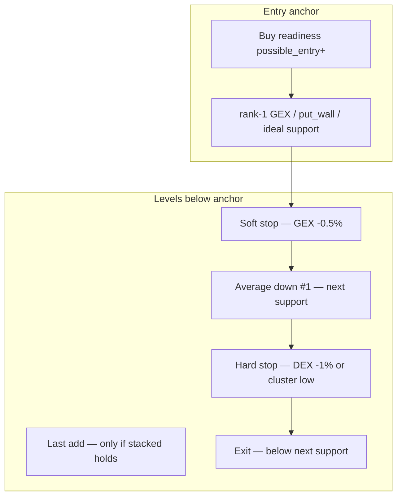

# Trade Management v2.1 — Entry Playbook (Static Level Plan)

## What changed from prior draft

**User clarification:** This is **not** real-time position monitoring. We do **not** need prior entry price, ring buffers, sustain timers, or a live `stop_score` that updates every tick.

**What we want:** When the system says **buy** (or average in) at a support, answer:

> *"If I enter here, what supports below are my **stop** vs **average down** levels — and when should I exit instead of adding?"*

That is a **static playbook** derived from the options ladder at snapshot time, anchored to the **entry support** (not `% stop-loss` primary).

---

## Mental model



**Bad trade (noise):** price dips toward soft stop but **holds above hard stop** — hold or small add at planned add level.

**Wrong trade:** price **closes meaningfully below hard stop** — exit; do not average down further.

No server-side memory of when you entered.

---

## Goals

Add `trade_plan` to **GetConfluence**, **GetConfluenceSummary**, jax-ov:

1. **Entry zone** — where buy/average-in is justified now
2. **Stops below** — ordered failure prices (soft → hard → final)
3. **Average-down below** — where a small add is structurally justified vs exit

Keep existing `sell_score` for **profit-taking at resistance** (unchanged).

**Explicitly out of scope:**
- `entry_price` / `entry_time` request params
- Processor ring buffers / sustained-break detection
- Long or short time-based exits
- Live `stop_score` composite (replaced by level-based playbook + optional `spot_vs_plan` context)

---

## 1. Entry anchor selection

New [`pkg/confluence/trade_plan.go`](pkg/confluence/trade_plan.go) — pure function from `ConfluenceSnapshot` / levels:

**Anchor priority** (first available):

1. **Rank-1 GEX support** ([`Rank1GEXSupport`](pkg/confluence/signals/levels.go))
2. **`put_wall`** (if no GEX support)
3. **`nearest_support`**

**When to emit a plan:**

| Buy readiness | Plan |
|---------------|------|
| `possible_entry` or `high_conviction` | Full playbook |
| `caution` | Playbook with note "setup not fully confirmed" |
| `no_trade` | Omit or `trade_plan: null` |

Anchor price = support level price (not necessarily current spot). Include `distance_from_spot_pct` so human sees if they're early/late.

---

## 2. Stop levels below anchor

Computed downward from anchor using existing ladder + OpenAI-style buffers:

| Tier | Source | Price rule | Action label |
|------|--------|------------|--------------|
| **soft_stop** | GEX anchor | `anchor × (1 - 0.005)` | Wick tolerance — watch, don't panic |
| **structure_stop** | Rank-1 DEX support below anchor | DEX price | Primary thesis line — exit if lost |
| **hard_stop** | DEX | `dex × (1 - 0.010)` | Confirmed break — exit, no adds |
| **stacked_stop** | Lowest support in stacked cluster (if `stacked_zone`) | cluster low | Below entire confluence zone |
| **final_stop** | `SecondSupport` or next ladder rung below hard_stop | level price | Full invalidation |

Only include tiers that exist **below anchor** on the ladder. Sort by price descending (nearest stop first).

Example (NET-style):

```json
"stops": [
  { "tier": "soft_stop",   "price": 243.78, "source": "gex", "rule": "0.5% below entry GEX 245.00", "action": "watch" },
  { "tier": "structure_stop","price": 240.00, "source": "dex", "rule": "rank-1 DEX support",           "action": "exit_if_lost" },
  { "tier": "hard_stop",     "price": 237.60, "source": "dex", "rule": "1.0% below DEX 240.00",        "action": "exit" }
]
```

Config in [`confluence-configs/settings.yaml`](confluence-configs/settings.yaml):

```yaml
trade_plan:
  gex_stop_buffer_pct: 0.005
  dex_stop_buffer_pct: 0.010
```

---

## 3. Average-down levels below anchor

Only supports **between anchor and hard_stop** (never below `exit_instead_of_add`):

| Tier | Typical source | Condition (human-readable) |
|------|----------------|----------------------------|
| **starter** | Entry anchor | "Initial buy / average-in here when readiness ≥ possible_entry" |
| **add_1** | Next support down (DEX or rank-2) | "Small add only if price holds above structure_stop and reclaims anchor" |
| **add_2** | Second support (if stacked) | "Last small add — only if stacked zone intact" |

```json
"average_down": [
  {
    "tier": "starter",
    "price": 245.00,
    "size_hint": "small",
    "condition": "Buy/average-in at rank-1 GEX support (ideal entry)"
  },
  {
    "tier": "add_1",
    "price": 240.00,
    "size_hint": "small",
    "condition": "Add only if still above hard stop 237.60 and reclaims 245",
    "if_below": "exit_instead"
  }
],
"exit_instead_of_add_below": 237.60
```

**Rules encoded in logic:**

- No add levels at or below `hard_stop` / `exit_instead_of_add_below`
- If only one support exists, `add_1` omitted; playbook says exit at hard_stop instead of averaging
- `size_hint`: `small` only (no position % — client decides sizing)

---

## 4. Spot context (optional, not position-aware)

Lightweight **snapshot-only** context — where is spot vs the plan **right now**:

```json
"spot_context": {
  "vs_entry_zone": "above",       // above | at | below
  "vs_soft_stop": "above",
  "vs_hard_stop": "above",
  "guidance": "At entry zone — playbook applies if you enter here"
}
```

If spot already below `hard_stop`, set `guidance`: *"Below hard stop — playbook was for entry higher; do not add — consider exit"*.

This is **not** tracking your entry; it's comparing live spot to the published plan.

Optional note field (not a score):

```json
"intraday_notes": [
  "Brief pierce of soft stop may be noise — prefer reclaim over single tick",
  "Lunch (12–1 ET) and last 15 min often see mean-reversion bounces"
]
```

Static strings in config/docs — **not** time-based auto-exit logic.

---

## 5. Summary projection

Extend [`pkg/confluence/summary.go`](pkg/confluence/summary.go):

```json
"trade_plan": {
  "entry_zone": { "price": 245.00, "source": "gex_support", "timing": "ideal" },
  "stops": [ ... ],
  "average_down": [ ... ],
  "exit_instead_of_add_below": 237.60,
  "spot_context": { "guidance": "..." }
}
```

Human one-liner in `reasons` when plan present:

- *"Enter ~245; soft stop 243.8; hard exit 237.6; add at 240 only on reclaim"*

`warnings` when spot below hard stop or upside gate failed.

**Remove from summary:** `verdict.stop`, `stop_score`, `trade_health`, ring-buffer fields.

---

## 6. API / proto

Add to [`api/proto/confluence/v1/confluence.proto`](api/proto/confluence/v1/confluence.proto):

```protobuf
message TradePlan {
  EntryZone entry_zone = 1;
  repeated StopLevel stops = 2;
  repeated AddLevel average_down = 3;
  double exit_instead_of_add_below = 4;
  SpotContext spot_context = 5;
  repeated string intraday_notes = 6;
}
```

Field on `ConfluenceSnapshot`: `TradePlan trade_plan = 53;`

Mirror on `ConfluenceSummary` message.

Wire in [`pkg/confluence/signals/score.go`](pkg/confluence/signals/score.go) `BuildSnapshot` after geometry/sell — call `confluence.BuildTradePlan(snap)`.

No new RPC.

---

## 7. Tests

| File | Cases |
|------|-------|
| `trade_plan_test.go` | NET: GEX 245 anchor → soft 243.78, DEX 240 hard 237.6; add between |
| `trade_plan_test.go` | No trade readiness → null plan |
| `trade_plan_test.go` | Spot below hard_stop → guidance says exit not add |
| `trade_plan_test.go` | Single support only → no add_1, exit at buffer |
| `summary_test.go` | trade_plan block + one-liner reason |

---

## 8. Docs

Update [`docs/confluence-llm-analysis.md`](docs/confluence-llm-analysis.md) and [`README.md`](README.md):

- **`trade_plan`** = pre-trade playbook at buy support; not live stop monitoring
- **`sell_score`** = resistance / profit-taking (unchanged)
- Distinguish **noise** (above hard stop) vs **wrong** (below hard stop) using plan tiers
- Note: wick below soft stop ≠ exit; lost structure_stop / hard_stop = exit
- Optional intraday bounce context is advisory text only

---

## Implementation order

1. `trade_plan.go` — anchor, stops, average_down, spot_context
2. Wire `BuildSnapshot` + proto + convert
3. Summary projection + tests + docs

---

## Deferred

- Client-supplied entry price for personalized plan
- Real-time stop_score / processor history
- Position size percentages
